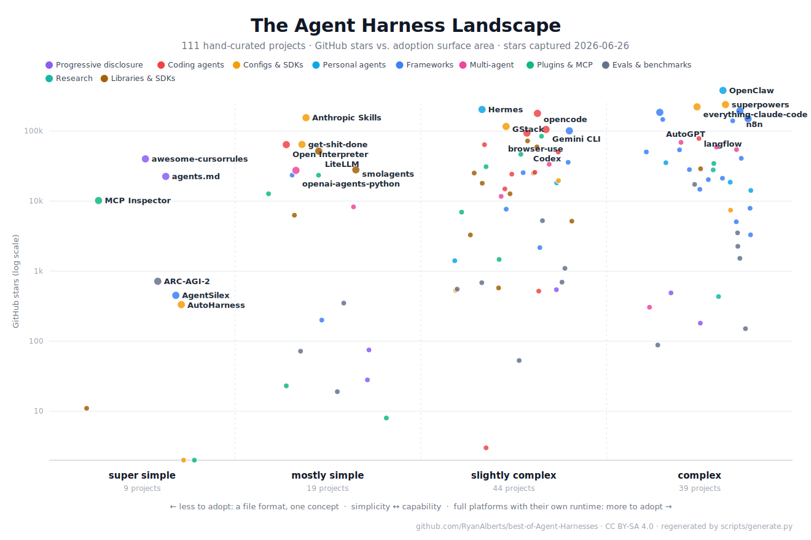
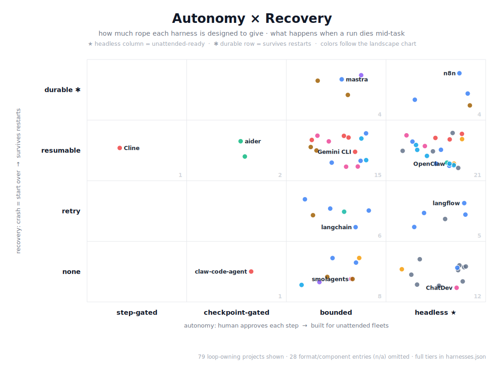

<!-- markdownlint-disable -->
<h1 align="center">
    Best of Agent Harnesses and Harness Techniques
    <br>
</h1>

<p align="center">
    <strong>🏆&nbsp; Curated list of AI agent harnesses, orchestration frameworks, and harness techniques for reliable agentic systems.</strong>
</p>

<p align="center">
    <a href="https://best-of.org" title="Best-of Badge"></a>
    <a href="#contents" title="Project Count"></a>
    <a href="https://ryanalberts.github.io/best-of-Agent-Harnesses/" title="Browse the searchable site"></a>
    <a href="#for-agents" title="Agents can query this list — MCP server, llms.txt & JSON"></a>
    <a href="#contribution" title="Contributions welcome"></a>
    <a href="https://github.com/RyanAlberts/best-of-Agent-Harnesses/commits/main" title="Updates"></a>
</p>

<p align="center">
    🌐 <strong><a href="https://ryanalberts.github.io/best-of-Agent-Harnesses/">Browse the searchable site</a></strong> — one page per harness, filter by capability, autonomy &amp; recovery.
</p>

<p align="center">
    🤖 <strong>Agents can query this list</strong> — an <a href="#for-agents">MCP server</a> (<code>recommend</code>, <code>pick_harness</code>, …), <a href="llms.txt">llms.txt</a> &amp; <a href="harnesses.json">JSON</a>, so your agent recommends harnesses too.
</p>

<p align="center">
    🧡 <strong>A curated list is only as good as the people who stop mid-scroll to point at what it's missing.</strong><br>
    These folks did exactly that — found a gap, wrote it up, and made the list better than one maintainer ever could.
    <a href="#-thank-you-contributors"><strong>Meet the 7 →</strong></a>
</p>

## What is an agent harness?

A model answers; an agent acts. An agent harness is the runtime that turns one into the other — the model thinks; the harness decides what that thinking is allowed to touch.

Every prior wave of automation was constrained by brittleness: you scripted exact behavior, and when the world deviated, the system broke. Foundation models inverted that problem—they're flexible but directionless, stateless, and disconnected from anything real. The agent harness exists to bridge that gap: it is the orchestration infrastructure that converts a model's per-turn reasoning into sustained, tool-using, error-recovering, goal-directed behavior across time. Architecturally, it plays the role the kernel played in operating systems or the controller played in industrial robotics—mediating between raw capability and a messy environment—but with a critical difference: the "capability" it governs is general-purpose cognition, which means the harness is simultaneously a scheduler, a permission system, a memory manager, and a policy enforcement layer, all under-specified and evolving in real time.

## Why harnesses matter

Better models make harnesses more important: more capabilities mean more failure modes, and production needs retry logic, fallbacks, and validation. Harness quality—not just model quality—determines whether agents actually ship. This list ranks projects by relevance to harness concerns (environment, orchestration, lifecycle, guardrails) and by stars/activity.

## The landscape at a glance

[](assets/landscape.svg)

_Every project in the list, plotted by adoption surface area (the [simplicity ↔ capability axis](#guide-to-rankings)) against GitHub stars. Colors are categories; the largest projects in each tier are labeled._

[](assets/axes-grid.svg)

_The same projects placed by how much unsupervised rope they're designed to give (autonomy) and what happens when a run dies (recovery). In the tables below, ★ marks headless-ready projects and ✱ marks durable ones. Both charts regenerate from the list data on every refresh._

## How to Pick a Harness

_Start with the guide, then the head-to-head decision pages — grounded in the same data as the tables below:_

- [**How to pick a harness**](comparisons/how-to-pick-a-harness.md) — six questions that turn this list into a decision, including the post–June 2026 billing reality
- [**OpenClaw vs Hermes**](comparisons/openclaw-vs-hermes.md) — the always-on personal-agent debate: presence vs discipline, plus what the field reports actually say
- [**Terminal coding agents** — opencode vs Codex vs Gemini CLI vs crush vs goose](comparisons/terminal-coding-agents.md)
- [**Multi-agent orchestration** — OpenAI Agents SDK vs CrewAI vs AutoGen vs LangGraph](comparisons/multi-agent-orchestration.md)
- [**Agent memory layers** — Mem0 vs Letta vs claude-mem](comparisons/memory-layers.md)

## Pick by use case

_Reader's index: pick by what you want to do, not by category. Tag chips (e.g. <sup>`mcp` · `memory`</sup>) next to each row let you cross-filter by capability — see [TAGS.md](TAGS.md) for the full cross-reference._

- **I want a turnkey coding agent today** — [opencode](https://github.com/anomalyco/opencode), [Cline](https://github.com/cline/cline), [Codex](https://github.com/openai/codex), [Gemini CLI](https://github.com/google-gemini/gemini-cli), [OpenHands](https://github.com/OpenHands/OpenHands), [crush](https://github.com/charmbracelet/crush) · see [Coding agent products (IDEs, CLIs, full suites)](#coding-agent-products-ides-clis-full-suites)
- **I want an always-on personal agent that lives in my chat apps** — [OpenClaw](https://github.com/openclaw/openclaw), [Hermes](https://github.com/NousResearch/hermes-agent), [Khoj](https://github.com/khoj-ai/khoj), [Agent Zero](https://github.com/agent0ai/agent-zero), [OpenHarness (HKUDS)](https://github.com/HKUDS/OpenHarness) · see [Personal agent runtimes](#personal-agent-runtimes)
- **I want to extend Claude Code, Codex, or OpenCode with skills and slash commands** — [Anthropic Skills](https://github.com/anthropics/skills), [wshobson/agents](https://github.com/wshobson/agents), [superpowers](https://github.com/obra/superpowers), [GStack](https://github.com/garrytan/gstack), [pmstack](https://github.com/RyanAlberts/pmstack) · see [Coding harness configs and SDKs](#coding-harness-configs-and-sdks)
- **I want to build my own coding harness from scratch** — [Claude Agent SDK](https://github.com/anthropics/claude-agent-sdk-python), [Google ADK](https://github.com/google/adk-python), [AutoHarness](https://github.com/aiming-lab/AutoHarness), [SWE-agent](https://github.com/SWE-agent/SWE-agent), [RepoMaster](https://github.com/QuantaAlpha/RepoMaster), [claw-code-agent](https://github.com/HarnessLab/claw-code-agent) · see [Coding harness configs and SDKs](#coding-harness-configs-and-sdks)
- **I want a drop-in memory layer for agents** — [Mem0](https://github.com/mem0ai/mem0), [claude-mem](https://github.com/thedotmack/claude-mem), [agentlog](https://github.com/RyanAlberts/agentlog), [agno](https://github.com/agno-agi/agno), [letta](https://github.com/letta-ai/letta) · see [Plugins, MCPs, CLI tools](#plugins-mcps-cli-tools)
- **I want to plug hundreds to thousands of tools without context bloat** — [MCP-Zero](https://github.com/xfey/MCP-Zero), [ToolGen](https://github.com/Reason-Wang/ToolGen), [ToolRAG](https://github.com/antl3x/ToolRAG), [langgraph-bigtool](https://github.com/langchain-ai/langgraph-bigtool) · see [Progressive disclosure harnesses](#progressive-disclosure-harnesses)
- **I want multi-agent orchestration** — [openai-agents-python](https://github.com/openai/openai-agents-python), [crewAI](https://github.com/crewAIInc/crewAI), [autogen](https://github.com/microsoft/autogen), [Microsoft Agent Framework](https://github.com/microsoft/agent-framework), [PraisonAI](https://github.com/MervinPraison/PraisonAI), [agent-squad](https://github.com/2FastLabs/agent-squad) · see [Multi-agent and orchestration](#multi-agent-and-orchestration)
- **I want a general LLM app framework** — [langgraph](https://github.com/langchain-ai/langgraph), [langchain](https://github.com/langchain-ai/langchain), [llama-index](https://github.com/run-llama/llama_index), [pydantic-ai](https://github.com/pydantic/pydantic-ai), [agno](https://github.com/agno-agi/agno) · see [Frameworks](#frameworks)
- **I want low-code / visual workflows** — [langflow](https://github.com/langflow-ai/langflow), [Flowise](https://github.com/FlowiseAI/Flowise), [Dify](https://github.com/langgenius/dify), [n8n](https://github.com/n8n-io/n8n) · see [Frameworks](#frameworks)
- **I want browser-using agents** — [browser-use](https://github.com/browser-use/browser-use), [WebVoyager](https://github.com/MinorJerry/WebVoyager), [puppeteer-real-browser-mcp](https://github.com/withLinda/puppeteer-real-browser-mcp-server) · see [Plugins, MCPs, CLI tools](#plugins-mcps-cli-tools)
- **I want sandboxed code execution for agent-generated code** — [E2B](https://github.com/e2b-dev/E2B), [Daytona](https://github.com/daytonaio/daytona), [smolagents](https://github.com/huggingface/smolagents), [OpenHands](https://github.com/OpenHands/OpenHands) · see [Libraries and SDKs](#libraries-and-sdks)
- **I want to evaluate or benchmark agents** — [SWE-bench](https://github.com/SWE-bench/SWE-bench), [AgencyBench](https://github.com/GAIR-NLP/AgencyBench), [inspect_ai](https://github.com/UKGovernmentBEIS/inspect_ai), [WebArena](https://github.com/web-arena-x/webarena), [ARC-AGI-2](https://github.com/arcprize/ARC-AGI-2), [VitaBench](https://github.com/meituan-longcat/vitabench) · see [Evaluation and benchmarking harnesses](#evaluation-and-benchmarking-harnesses)
- **I want a deep research / autonomous research agent** — [deepagents](https://github.com/langchain-ai/deepagents), [gpt-researcher](https://github.com/assafelovic/gpt-researcher), [openagents](https://github.com/OpenAgentsInc/openagents) · see [Research and task-specific harnesses](#research-and-task-specific-harnesses)
- **I want a provider-agnostic LLM pipe (not a framework)** — [LiteLLM](https://github.com/BerriAI/litellm), [vercel/ai](https://github.com/vercel/ai) · see [Libraries and SDKs](#libraries-and-sdks)

## For agents

This list is also published in machine-readable form, so coding agents and research agents can recommend harnesses — not just humans browsing GitHub:

- [**harnesses.json**](harnesses.json) — every project with category, complexity tier, capability tags, stars, license signal, and a concrete example link, plus the full use-case index.
- [**llms.txt**](llms.txt) — the entire list in one agent-readable file. Point any agent at the [raw URL](https://raw.githubusercontent.com/RyanAlberts/best-of-Agent-Harnesses/main/llms.txt).
- [**MCP server**](mcp/) — `recommend` (one opinionated pick + alternatives + what to *avoid*, e.g. repos flagged for star manipulation), `pick_harness` (ranked, with complexity/autonomy/recovery filters), `search_harnesses`, `get_harness`, `list_categories`, plus `list_comparisons`/`get_comparison` for the decision guides. Published to PyPI and the [official MCP registry](https://registry.modelcontextprotocol.io) as `io.github.RyanAlberts/agent-harnesses`. One-line install (needs [uv](https://docs.astral.sh/uv/)):

```sh
claude mcp add agent-harnesses -- uvx agent-harnesses-mcp
```

## Contents

- [The landscape at a glance](#the-landscape-at-a-glance)
- [How to Pick a Harness](#how-to-pick-a-harness)
- [Pick by use case](#pick-by-use-case)
- [For agents: harnesses.json, llms.txt, MCP server](#for-agents)
- [FAQ](#faq)
- [Progressive disclosure harnesses](#progressive-disclosure-harnesses) _6 projects_
- [Coding agent products (IDEs, CLIs, full suites)](#coding-agent-products-ides-clis-full-suites) _13 projects_
- [Coding harness configs and SDKs](#coding-harness-configs-and-sdks) _12 projects_
- [Personal agent runtimes](#personal-agent-runtimes) _8 projects_
- [Frameworks](#frameworks) _24 projects_
- [Multi-agent and orchestration](#multi-agent-and-orchestration) _9 projects_
- [Plugins, MCPs, CLI tools](#plugins-mcps-cli-tools) _15 projects_
- [Memory and state](#memory-and-state) _3 projects_
- [Evaluation and benchmarking harnesses](#evaluation-and-benchmarking-harnesses) _17 projects_
- [Observability and eval-ops](#observability-and-eval-ops) _2 projects_
- [Research and task-specific harnesses](#research-and-task-specific-harnesses) _2 projects_
- [Libraries and SDKs](#libraries-and-sdks) _13 projects_

## Guide to rankings

- ⭐ **Stars** — GitHub star count, captured 2026-07-12; tables sort by stars descending.
- ⚖️ **Simplicity ↔ capability** — adoption surface, 4 tiers: **super simple** (a format, one concept) → **mostly simple** (thin layer) → **slightly complex** (real SDK) → **complex** (product suite).
- ★ **Headless-ready** — designed for unattended runs, batches, and fleets (the top of the autonomy scale: step-gated → checkpoint-gated → bounded → headless).
- ✱ **Durable** — persisted execution state survives restarts mid-task (the top of the recovery scale: none → retry → resumable → durable).
- ✅ **Open source** — ✅ standard OSS license · ⚠️ source-available/restricted · ❓ no or unclear license.
- 🏷️ **Tags** — capability chips auto-derived from descriptions; full cross-reference in [TAGS.md](TAGS.md).
- 🎯 **Examples** — one concrete "show me it in action" link per project, not a docs root.

Every project's full autonomy and recovery tier is plotted in the [grid above](#the-landscape-at-a-glance) and carried in [harnesses.json](harnesses.json) and [llms.txt](llms.txt); scores are editorial, from public docs — maintainer corrections via issue/PR are merged fast.

<br>

## Progressive disclosure harnesses

<a href="#contents"></a>

_Formats, runtimes, and patterns that reveal context, tools, or instructions in layers—index first, details on demand—to control tokens and improve agent focus (the "map, not encyclopedia" principle)._

| # | Project | ⭐ Stars | Description | Open source | Simplicity ↔ capability | Examples |
|---|---------|---------|-------------|-------------|-------------------------|----------|
| 1 | <a name="awesome-cursorrules"></a>[**awesome-cursorrules**](https://github.com/PatrickJS/awesome-cursorrules) | [40.3k](https://github.com/PatrickJS/awesome-cursorrules/stargazers) | Curated .cursorrules and skills that leverage Cursor's index-then-load model; the canonical collection for rules-as-progressive-disclosure in the IDE. <sup>`ide`</sup> | ✅ | super simple (content bundle) | [PyTorch cursorrules](https://github.com/PatrickJS/awesome-cursorrules/blob/main/rules/pytorch-scikit-learn-cursorrules-prompt-file.mdc) |
| 2 | <a name="agentsmd"></a>[**agents.md**](https://github.com/agentsmd/agents.md) | [23k](https://github.com/agentsmd/agents.md/stargazers) | Open format for repo-scoped agent briefings; v1.1 adds hierarchical scope and progressive disclosure so agents get a map of what exists, then load only what's relevant. <sup>`typescript`</sup> | ✅ | super simple (format only) | [Self-hosting AGENTS.md](https://github.com/agentsmd/agents.md/blob/main/AGENTS.md) |
| 3 | <a name="langgraph-bigtool"></a>[**langgraph-bigtool**](https://github.com/langchain-ai/langgraph-bigtool)&#8202;✱ | [545](https://github.com/langchain-ai/langgraph-bigtool/stargazers) | Build LangGraph agents with large tool sets; retrieval and on-demand tool loading so agents scale beyond context without stuffing every schema upfront. <sup>`tool-discovery` · `python`</sup> | ✅ | slightly complex (large tool sets) | [Math-library tool agent](https://github.com/langchain-ai/langgraph-bigtool#quickstart) |
| 4 | <a name="mcp-zero"></a>[**MCP-Zero**](https://github.com/xfey/MCP-Zero) | [490](https://github.com/xfey/MCP-Zero/stargazers) | Active tool discovery for autonomous agents: model requests tools by requirement; hierarchical semantic routing over 308 servers / 2,797 tools with ~98% token reduction (APIBank). <sup>`tool-discovery`</sup> | ✅ | complex (3k tools, full routing) | [APIBank experiment](https://github.com/xfey/MCP-Zero/blob/master/MCP-zero/experiment_apibank.py) |
| 5 | <a name="toolgen"></a>[**ToolGen**](https://github.com/Reason-Wang/ToolGen) | [182](https://github.com/Reason-Wang/ToolGen/stargazers) | ICLR 2025: unified tool retrieval and calling via generation; 47k+ tools without context stuffing—retrieval and invocation in one generative step. <sup>`tool-discovery` · `python`</sup> | ❓ | complex (47k+ tools) | [Full eval pipeline](https://github.com/Reason-Wang/ToolGen/blob/master/scripts/eval_full_pipeline.sh) |
| 6 | <a name="toolrag"></a>[**ToolRAG**](https://github.com/antl3x/ToolRAG) | [29](https://github.com/antl3x/ToolRAG/stargazers) | Semantic tool retrieval for LLMs; serves only the tools the user query demands (MCP-compatible), unlimited tool sets with zero context penalty. <sup>`mcp` · `tool-discovery`</sup> | ✅ | mostly simple (query-driven retrieval) | [MCP server retrieval](https://github.com/antl3x/ToolRAG/blob/main/packages/%40antl3x-toolrag/README.md) |

## Coding agent products (IDEs, CLIs, full suites)

<a href="#contents"></a>

_Turnkey coding agents you install and run: IDE extensions, terminal CLIs, Dockerized workspaces. Each entry notes which part is the harness (the agent loop, tool wiring, approval model) versus the UI shell (VS Code extension, TUI, browser client)._

| # | Project | ⭐ Stars | Description | Open source | Simplicity ↔ capability | Examples |
|---|---------|---------|-------------|-------------|-------------------------|----------|
| 1 | <a name="opencode"></a>[**opencode**](https://github.com/anomalyco/opencode)&#8202;★ | [185k](https://github.com/anomalyco/opencode/stargazers) | Open-source terminal coding agent (formerly `sst/opencode`; transferred to anomalyco). The **harness** is a multi-provider tool-call loop (Claude, OpenAI, Gemini, local) with strong plugin and MCP support; the TUI is the shell. 100% OSS, very actively shipped. <sup>`mcp` · `provider-agnostic` · `cli` · `tui` · `typescript`</sup> | ✅ | slightly complex (multi-provider, plugins, MCP) | [Agent system page](https://opencode.ai/docs/agents/) |
| 2 | <a name="gemini-cli"></a>[**Gemini CLI**](https://github.com/google-gemini/gemini-cli) | [106k](https://github.com/google-gemini/gemini-cli/stargazers) | Google's first-party terminal agent for Gemini. The **harness** is the plugin/MCP tool-call loop; the terminal is the shell—Google's parallel to Claude Code / Codex, not just an API. <sup>`mcp` · `cli` · `typescript`</sup> | ✅ | slightly complex (official CLI, plugins, MCP) | [MCP server setup](https://github.com/google-gemini/gemini-cli/blob/main/docs/tools/mcp-server.md) |
| 3 | <a name="codex"></a>[**Codex**](https://github.com/openai/codex) | [97.3k](https://github.com/openai/codex/stargazers) | OpenAI's terminal coding agent. The **harness** is the sandboxed tool-call loop with multi-provider support; the CLI is the shell. Reference implementation for "official CLI that ships code." <sup>`sandbox` · `provider-agnostic` · `cli`</sup> | ✅ | slightly complex (reference CLI, sandboxed) | [Sandboxing concept](https://developers.openai.com/codex/concepts/sandboxing) |
| 4 | <a name="openhands"></a>[**OpenHands**](https://github.com/OpenHands/OpenHands)&#8202;★ | [80.5k](https://github.com/OpenHands/OpenHands/stargazers) | Dockerized software-engineering agent. The **harness** is the bash/editor/browser toolset with micro-agents and event-stream session bridging; Docker is the sandbox. Main OSS choice for teams self-hosting autonomous repo work. <sup>`memory` · `browser` · `sandbox` · `python`</sup> | ⚠️ (multi-license) | complex (Docker runtime, multi-surface agent — product suite) | [Repository microagents](https://docs.all-hands.dev/usage/prompting/microagents-repo) |
| 5 | <a name="pi"></a>[**pi**](https://github.com/earendil-works/pi) | [69.8k](https://github.com/earendil-works/pi/stargazers) | The upstream AI agent toolkit behind this list's oh-my-pi fork: a unified multi-provider LLM API, agent loop, and TUI shell providing the **harness** that oh-my-pi's Rust rewrite builds on. <sup>`provider-agnostic` · `tui` · `rust`</sup> | ❓ | slightly complex (multi-provider agent loop, TUI) | [Project README](https://github.com/earendil-works/pi#readme) |
| 6 | <a name="cline"></a>[**Cline**](https://github.com/cline/cline) | [64.6k](https://github.com/cline/cline/stargazers) | VS Code extension whose **harness** is a plan-then-act loop with per-step human approval and cost transparency; the VS Code integration is the UI shell. Open-source counterweight to Cursor. <sup>`ide` · `typescript`</sup> | ✅ | slightly complex (plan-then-act, approval gates) | [Plan & Act mode](https://docs.cline.bot/features/plan-and-act) |
| 7 | <a name="openinterpreter"></a>[**Open Interpreter**](https://github.com/openinterpreter/openinterpreter) | [64.4k](https://github.com/openinterpreter/openinterpreter/stargazers) | Lightweight terminal coding agent oriented to open models (DeepSeek, Kimi, Qwen). The **harness** is a code-execution loop — the model writes code, the harness executes it with confirmation gates; the CLI is the shell. The original "let the LLM run code on my machine" project, reborn for open weights. <sup>`cli` · `python`</sup> | ✅ | mostly simple (lean code-exec loop) | [Quick start](https://github.com/openinterpreter/openinterpreter#readme) |
| 8 | <a name="goose"></a>[**goose**](https://github.com/aaif-goose/goose)&#8202;★ | [51.1k](https://github.com/aaif-goose/goose/stargazers) | Block-originated Rust agent, now stewarded by the Linux Foundation's Agentic AI Foundation (`aaif-goose/goose`). The **harness** is the MCP/ACP extension model with recipes and provider choice; there's no fixed UI slot—you bolt it into whatever shell you use. <sup>`mcp` · `rust`</sup> | ✅ | slightly complex (extensions, MCP/ACP) | [Goose recipes guide](https://block.github.io/goose/docs/guides/recipes/) |
| 9 | <a name="crush"></a>[**crush**](https://github.com/charmbracelet/crush) | [26.5k](https://github.com/charmbracelet/crush/stargazers) | Charm's terminal coding agent (Charm's fork of the original OpenCode). The **harness** is the tool-calling loop with session persistence; the Bubble Tea TUI is the shell. <sup>`memory` · `cli` · `tui`</sup> | ⚠️ FSL-1.1-MIT | slightly complex (terminal agent, TUI) | [Crush launch post](https://charm.land/blog/crush-comes-home/) |
| 10 | <a name="oh-my-pi"></a>[**oh-my-pi**](https://github.com/can1357/oh-my-pi) | [17.4k](https://github.com/can1357/oh-my-pi/stargazers) | Terminal coding agent (fork of Pi) that wires the IDE into the **harness**: hash-anchored edits, a 32-tool loop tuned per-model, LSP rename/references/diagnostics on every write, a real DAP debugger (lldb/dlv/debugpy), long-lived Python + Bun execution kernels that call back into the agent's tools, browser control, and 40+ providers (Claude/OpenAI/Gemini/local). ~55k-line Rust core. <sup>`browser` · `provider-agnostic` · `cli` · `ide` · `rust`</sup> | ✅ | slightly complex (terminal agent, LSP/DAP, multi-provider) | [LSP wired into edits](https://github.com/can1357/oh-my-pi/blob/main/docs/lsp-config.md) |
| 11 | <a name="claw-code-agent"></a>[**claw-code-agent**](https://github.com/HarnessLab/claw-code-agent) | [528](https://github.com/HarnessLab/claw-code-agent/stargazers) | Python reimplementation of the Claude Code agent architecture with zero external dependencies; interactive chat, streaming, plugin runtime, nested agent delegation, cost tracking, MCP transport—portable harness without the Rust/TS toolchain. <sup>`mcp` · `rust` · `python` · `typescript`</sup> | ❓ | slightly complex (pure Python, plugin runtime) | [Quick Start guide](https://github.com/HarnessLab/claw-code-agent#-quick-start) |
| 12 | <a name="agentbox"></a>[**AgentBox**](https://github.com/madarco/agentbox) | [247](https://github.com/madarco/agentbox/stargazers) | Runs multiple coding agents in parallel, each in its own sandboxed VM, locally or in the cloud, from one command. The **harness** contribution is the VM-per-agent isolation and fleet fan-out layer; whichever agent runs inside owns the loop. <sup>`sandbox` · `typescript`</sup> | ✅ | slightly complex (VM-per-agent sandbox, parallel fan-out) | [Parallel agents quick start](https://github.com/madarco/agentbox#readme) |
| 13 | <a name="proliferate"></a>[**Proliferate**](https://github.com/proliferate-ai/proliferate) | [151](https://github.com/proliferate-ai/proliferate/stargazers) | Open-source AI IDE for Claude Code, Codex, OpenCode, and more. The **harness** contribution is the workspace/session orchestration layer: run multiple coding agents in parallel, locally or in the cloud, with isolated workspaces, reusable workflows, and shared team context. <sup>`multi-agent` · `sandbox` · `ide` · `typescript`</sup> | ✅ | complex (multi-agent workspace orchestration — product suite) | [Product README](https://github.com/proliferate-ai/proliferate#readme) |

## Coding harness configs and SDKs

<a href="#contents"></a>

_Skill packs, slash-command libraries, meta-prompting frameworks, and official SDKs that give you the harness (the agent loop, planning, memory, hooks) without bundling a specific IDE or CLI shell._

| # | Project | ⭐ Stars | Description | Open source | Simplicity ↔ capability | Examples |
|---|---------|---------|-------------|-------------|-------------------------|----------|
| 1 | <a name="superpowers"></a>[**superpowers**](https://github.com/obra/superpowers) | [253k](https://github.com/obra/superpowers/stargazers) | Performance-oriented harness pack for Claude Code, Codex, OpenCode, Cursor: skills, instincts, memory, security, research-first workflows. Treats harness engineering itself as the performance lever. <sup>`memory` · `ide`</sup> | ✅ | complex (multi-IDE skill stack — product suite) | [TDD skill](https://github.com/obra/superpowers/blob/main/skills/test-driven-development/SKILL.md) |
| 2 | <a name="skills"></a>[**Anthropic Skills**](https://github.com/anthropics/skills) | [161k](https://github.com/anthropics/skills/stargazers) | Anthropic's official Agent Skills repository: SKILL.md-based folders (instructions, scripts, resources) Claude dynamically loads on Claude Code, Claude.ai, and the API. The reference for progressive-disclosure skill packs in 2026. | ✅ | mostly simple (official skills format) | [docx skill](https://github.com/anthropics/skills/blob/main/skills/docx/SKILL.md) |
| 3 | <a name="gstack"></a>[**GStack**](https://github.com/garrytan/gstack) | [121k](https://github.com/garrytan/gstack/stargazers) | Garry Tan's Claude Code skill stack: 23 slash-command modes (CEO/eng/design review, QA, ship, browse, retro, …) that structure one assistant as a virtual engineering team. Daily driver while running YC. <sup>`typescript`</sup> | ✅ | slightly complex (multi-role slash-command harness) | [/ship SKILL.md](https://github.com/garrytan/gstack/blob/main/ship/SKILL.md) |
| 4 | <a name="agents"></a>[**wshobson/agents**](https://github.com/wshobson/agents) | [37.8k](https://github.com/wshobson/agents/stargazers) | Cross-harness marketplace of drop-in subagents and skills for Claude Code, Codex CLI, Cursor, OpenCode, and Copilot; specialized, production-ready agent definitions you install rather than hand-write. <sup>`multi-agent` · `cli` · `ide`</sup> | ✅ | super simple (drop-in agent packs) | [Agent catalog](https://github.com/wshobson/agents#readme) |
| 5 | <a name="swe-agent"></a>[**SWE-agent**](https://github.com/SWE-agent/SWE-agent)&#8202;★ | [19.8k](https://github.com/SWE-agent/SWE-agent/stargazers) | LM-driven harness built for SWE-bench: edit state, command execution, and issue-focused loop—the reference agent stack next to the benchmark itself. <sup>`memory` · `evals` · `python`</sup> | ✅ | slightly complex (SWE-bench pairing, stateful edits) | [Default agent config](https://github.com/SWE-agent/SWE-agent/blob/main/config/default.yaml) |
| 6 | <a name="claude-agent-sdk-python"></a>[**Claude Agent SDK**](https://github.com/anthropics/claude-agent-sdk-python)&#8202;★ | [7.6k](https://github.com/anthropics/claude-agent-sdk-python/stargazers) | Official Anthropic SDK (Python + [TypeScript](https://github.com/anthropics/claude-agent-sdk-typescript), [demos](https://github.com/anthropics/claude-agent-sdk-demos), [quickstarts](https://github.com/anthropics/claude-quickstarts)): built-in tools, MCP, long-running coding agents with session bridging. <sup>`mcp` · `memory` · `python` · `typescript`</sup> | ✅ | complex (full SDK, session bridging — product suite) | [Research agent demo](https://github.com/anthropics/claude-agent-sdk-demos/blob/main/research-agent/research_agent/agent.py) |
| 7 | <a name="agents-cli"></a>[**agents-cli**](https://github.com/google/agents-cli) | [5.1k](https://github.com/google/agents-cli/stargazers) | Google's official CLI and skill pack that layers agent-creation, evaluation, and deployment skills on top of whatever coding assistant you already run, rather than shipping its own agent loop—the **harness** as a config/skills add-on, not a new runtime. <sup>`evals` · `cli`</sup> | ❓ | mostly simple (skills/CLI layer, no new runtime) | [Project README](https://github.com/google/agents-cli#readme) |
| 8 | <a name="skillhub"></a>[**skillhub**](https://github.com/iflytek/skillhub) | [4k](https://github.com/iflytek/skillhub/stargazers) | iFlytek's self-hosted registry for publishing, versioning, and governing agent skill packages—the **harness** config layer treated as an enterprise artifact store rather than a CLI or IDE shell. <sup>`local` · `cli` · `ide`</sup> | ❓ | mostly simple (skill registry/governance) | [Project README](https://github.com/iflytek/skillhub#readme) |
| 9 | <a name="repomaster"></a>[**RepoMaster**](https://github.com/QuantaAlpha/RepoMaster)&#8202;★ | [533](https://github.com/QuantaAlpha/RepoMaster/stargazers) | Repo-scoped research harness: builds function-call and module-dependency graphs to explore only what's needed; large relative gains on MLE-bench and GitTaskBench with lower token use. <sup>`workflow` · `python`</sup> | ❓ | slightly complex (graph-based exploration) | [PDF-parse case study](https://github.com/QuantaAlpha/RepoMaster/blob/main/example/pdf_parse.md) |
| 10 | <a name="autoharness"></a>[**AutoHarness**](https://github.com/aiming-lab/AutoHarness) | [347](https://github.com/aiming-lab/AutoHarness/stargazers) | Lightweight governance harness: wraps any LLM client in ~2 lines for automated harness engineering—6–14 step pipeline, YAML constitution, risk-pattern matching, session persistence with cost tracking, multi-agent profiles. <sup>`memory` · `multi-agent` · `provider-agnostic` · `python`</sup> | ✅ | super simple (2-line wrapper, YAML gov) | [Full pipeline demo](https://github.com/aiming-lab/AutoHarness/blob/main/examples/full_pipeline_demo.py) |
| 11 | <a name="looptroop"></a>[**LoopTroop**](https://github.com/looptroop-ai/LoopTroop) | [60](https://github.com/looptroop-ai/LoopTroop/stargazers) | Config layer that chains LLM councils for planning, Ralph loops for iterative refinement, and OpenCode worktrees for shipping. The **harness** contribution is the council → loop → worktree pipeline; OpenCode underneath executes. <sup>`typescript`</sup> | ✅ | mostly simple (config pipeline over OpenCode) | [Council → loop → worktree pipeline](https://github.com/looptroop-ai/LoopTroop#readme) |
| 12 | <a name="pmstack"></a>[**pmstack**](https://github.com/RyanAlberts/pmstack) | [5](https://github.com/RyanAlberts/pmstack/stargazers) | Claude Code config for AI product managers: CLAUDE.md plus skills for competitive analysis, PRD-from-signal, metric frameworks, stakeholder briefs, and agent eval design. "GStack for PMs." <sup>`evals`</sup> | ✅ | super simple (skills bundle, PM-focused) | [PRD-from-signal skill](https://github.com/RyanAlberts/pmstack/blob/main/skills/prd-from-signal.md) |

## Personal agent runtimes

<a href="#contents"></a>

_Always-on, self-hosted agents you run as a daemon and talk to from chat apps: gateway runtimes, second brains, and self-improving assistants. The agent as a product you operate, not a library you build with._

| # | Project | ⭐ Stars | Description | Open source | Simplicity ↔ capability | Examples |
|---|---------|---------|-------------|-------------|-------------------------|----------|
| 1 | <a name="openclaw"></a>[**OpenClaw**](https://github.com/openclaw/openclaw)&#8202;★ | [383k](https://github.com/openclaw/openclaw/stargazers) | Self-hosted, always-on personal agent (formerly Clawdbot/Moltbot): a gateway + event-loop runtime that treats messages, heartbeats, crons, and webhooks as one input queue, persists state to local files, and lives in your chat apps (WhatsApp, Telegram, Slack, Discord). 13,700+ community skills; the fastest-growing repo in GitHub history. <sup>`typescript` · `multi-agent`</sup> | ✅ | complex (always-on runtime, channels, skill ecosystem — product suite) | [Agent runtime architecture](https://github.com/openclaw/openclaw/blob/main/docs/agent-runtime-architecture.md) |
| 2 | <a name="hermes-agent"></a>[**Hermes**](https://github.com/NousResearch/hermes-agent)&#8202;★ | [214k](https://github.com/NousResearch/hermes-agent/stargazers) | Nous Research's self-improving agent: a learning loop turns experience into reusable skills, builds a persistent user model across sessions, and checkpoints state to disk with rollback; lean enough for a $5 VPS, driven from chat, and model-agnostic (Nous Portal, OpenRouter, OpenAI, or any endpoint). <sup>`memory` · `python` · `provider-agnostic`</sup> | ✅ | slightly complex (lean runtime, learning loop, disk-first memory) | [Built-in skills](https://github.com/NousResearch/hermes-agent/tree/main/skills) |
| 3 | <a name="khoj"></a>[**Khoj**](https://github.com/khoj-ai/khoj)&#8202;★ | [35.7k](https://github.com/khoj-ai/khoj/stargazers) | Self-hostable "AI second brain": answers over your docs and the web, custom agents, scheduled automations, and multi-client reach (web, Obsidian, Emacs, WhatsApp). A personal-agent harness with retrieval at the core. <sup>`python`</sup> | ✅ | complex (server + clients — product suite) | [Feature tour](https://github.com/khoj-ai/khoj#readme) |
| 4 | <a name="eliza"></a>[**Eliza**](https://github.com/elizaOS/eliza)&#8202;★ | [18.7k](https://github.com/elizaOS/eliza/stargazers) | Open "agentic operating system" (elizaOS): persistent multi-agent runtime with character files, a plugin ecosystem, and social/platform integrations — the harness behind a large share of autonomous social agents. <sup>`memory` · `multi-agent` · `typescript`</sup> | ✅ | complex (runtime + plugin ecosystem — product suite) | [Agent quickstart](https://github.com/elizaOS/eliza#readme) |
| 5 | <a name="agent-zero"></a>[**Agent Zero**](https://github.com/agent0ai/agent-zero) | [18.4k](https://github.com/agent0ai/agent-zero/stargazers) | Organic, prompt-defined personal agent framework: hierarchical sub-agents, persistent memory, browser and code tools, and self-modifying behavior; runs in Docker with a web UI. <sup>`memory` · `multi-agent` · `browser` · `sandbox` · `python`</sup> | ❓ | slightly complex (prompt-defined, Docker + web UI) | [Framework tour](https://github.com/agent0ai/agent-zero#readme) |
| 6 | <a name="openharness"></a>[**OpenHarness (HKUDS)**](https://github.com/HKUDS/OpenHarness) | [14.7k](https://github.com/HKUDS/OpenHarness/stargazers) | Open agent harness with a built-in personal agent ("Ohmo") that runs across Feishu, Slack, Telegram, and Discord; core tool-use, skills, memory, multi-agent coordination with auto-compaction for multi-day sessions. <sup>`memory` · `multi-agent`</sup> | ✅ | complex (personal agent + multi-channel — product suite) | [harness-eval skill](https://github.com/HKUDS/OpenHarness/blob/main/.claude/skills/harness-eval/SKILL.md) |
| 7 | <a name="ailice"></a>[**AIlice**](https://github.com/myshell-ai/AIlice) | [1.4k](https://github.com/myshell-ai/AIlice/stargazers) | Fully autonomous general-purpose agent; one binary, Docker-ready, for when you want "set goal and walk away" without a framework. <sup>`sandbox` · `python`</sup> | ✅ | slightly complex (autonomous, one binary) | [Task showcase](https://github.com/myshell-ai/AIlice#cool-things-we-can-do) |
| 8 | <a name="talon"></a>[**Talon**](https://github.com/dylanneve1/talon)&#8202;★ | [64](https://github.com/dylanneve1/talon/stargazers) | Multi-platform personal agent living in Telegram, Discord, Teams, and the terminal. The **harness** is a pluggable-backend loop (Claude, Kilo, OpenCode, Codex, OpenAI Agents) with full MCP tool access and persistent background agents (Goals, Heartbeat, Dream); the chat apps are shells. <sup>`mcp` · `memory` · `cli` · `typescript`</sup> | ✅ | slightly complex (multi-platform, pluggable backends, MCP) | [Multi-platform setup](https://github.com/dylanneve1/talon#readme) |

## Frameworks

<a href="#contents"></a>

_General-purpose agent and LLM application frameworks (the app layer, not harnesses per se)._

| # | Project | ⭐ Stars | Description | Open source | Simplicity ↔ capability | Examples |
|---|---------|---------|-------------|-------------|-------------------------|----------|
| 1 | <a name="n8n"></a>[**n8n**](https://github.com/n8n-io/n8n)&#8202;★&#8202;✱ | [196k](https://github.com/n8n-io/n8n/stargazers) | Fair-code workflow engine with 400+ nodes and native AI nodes; the self-hosted Zapier that actually does agents and LangChain. <sup>`workflow` · `local` · `typescript`</sup> | ⚠️ Fair-code | complex (400+ nodes, workflow engine — product suite) | [Agent vs chain workflow](https://github.com/n8n-io/n8n-docs/blob/main/docs/advanced-ai/examples/agent-chain-comparison.md) |
| 2 | <a name="autogpt"></a>[**AutoGPT**](https://github.com/Significant-Gravitas/AutoGPT)&#8202;★ | [185k](https://github.com/Significant-Gravitas/AutoGPT/stargazers) | The original autonomous loop: goal in, agent iterates with tools and memory; Forge is the dev framework, Benchmark the eval harness. <sup>`memory` · `evals` · `python`</sup> | ⚠️ Polyform-SU | complex (autonomous loop, tools, memory — product suite) | [Medium blogger graph](https://github.com/Significant-Gravitas/AutoGPT/blob/master/autogpt_platform/graph_templates/Medium%20Blogger_v28.json) |
| 3 | <a name="langflow"></a>[**langflow**](https://github.com/langflow-ai/langflow)&#8202;★ | [152k](https://github.com/langflow-ai/langflow/stargazers) | Low-code UI to build and deploy LangChain/LangGraph flows; visual DAG editor and one-click run. <sup>`low-code` · `python`</sup> | ✅ | complex (low-code, visual — product suite) | [Chat with RAG flow](https://github.com/langflow-ai/langflow/blob/main/docs/docs/Tutorials/chat-with-rag.mdx) |
| 4 | <a name="dify"></a>[**Dify**](https://github.com/langgenius/dify)&#8202;★ | [149k](https://github.com/langgenius/dify/stargazers) | One-stop LLM app platform: visual workflows, RAG pipeline, 50+ tools, model management; "ship from prototype to prod" in a single UI. <sup>`low-code` · `rag` · `python`</sup> | ⚠️ Fair-code | complex (one-stop platform — product suite) | [Customer-service bot](https://github.com/langgenius/dify-docs/blob/main/en/use-dify/tutorials/customer-service-bot.mdx) |
| 5 | <a name="langchain"></a>[**langchain**](https://github.com/langchain-ai/langchain) | [142k](https://github.com/langchain-ai/langchain/stargazers) | Chains, tools, retrievers, and agents; the usual entry point for "add tools to an LLM" in Python/JS. <sup>`python`</sup> | ✅ | complex (kitchen-sink ecosystem — product suite) | [Build an agent notebook](https://github.com/langchain-ai/langchain-academy/blob/main/module-1/agent.ipynb) |
| 6 | <a name="browser-use"></a>[**browser-use**](https://github.com/browser-use/browser-use) | [104k](https://github.com/browser-use/browser-use/stargazers) | Python layer over Playwright: natural-language goals become browser actions—web-agent loop without hand-rolling MCP or a custom driver for every site. <sup>`mcp` · `browser` · `python`</sup> | ✅ | slightly complex (LLM + browser, Playwright) | [Grocery shopping agent](https://github.com/browser-use/browser-use/blob/main/examples/use-cases/shopping.py) |
| 7 | <a name="flowise"></a>[**Flowise**](https://github.com/FlowiseAI/Flowise)&#8202;★ | [54.5k](https://github.com/FlowiseAI/Flowise/stargazers) | Drag-and-drop LangChain UI; deploy flows without code. The low-code sibling to Langflow, with a different component and hosting story. <sup>`low-code` · `typescript`</sup> | ⚠️ Apache+CLA | complex (low-code, drag-drop — product suite) | [Agentic RAG flow](https://github.com/FlowiseAI/Flowise/blob/main/packages/server/marketplaces/agentflowsv2/Agentic%20RAG.json) |
| 8 | <a name="llama_index"></a>[**llama-index**](https://github.com/run-llama/llama_index) | [50.8k](https://github.com/run-llama/llama_index/stargazers) | Data-centric: indexing, RAG, and query engines; agent abstractions sit on top of your data pipelines. <sup>`rag` · `python`</sup> | ✅ | complex (RAG + agents — product suite) | [Research assistant workflow](https://github.com/run-llama/llama_index/blob/main/docs/examples/agent/agent_workflow_research_assistant.ipynb) |
| 9 | <a name="agno"></a>[**agno**](https://github.com/agno-agi/agno) | [41.1k](https://github.com/agno-agi/agno/stargazers) | Python agents with memory, knowledge bases, tools, and structured outputs; continues the PhiData-era product line under the Agno name—production apps, evals, and pipelines. <sup>`memory` · `evals` · `python`</sup> | ✅ | complex (memory, KB, observability — product suite) | [Agent with tools](https://github.com/agno-agi/agno/blob/main/cookbook/02_agents/01_quickstart/agent_with_tools.py) |
| 10 | <a name="langgraph"></a>[**langgraph**](https://github.com/langchain-ai/langgraph)&#8202;★&#8202;✱ | [37.1k](https://github.com/langchain-ai/langgraph/stargazers) | State-machine graphs over LLM steps; checkpointing, human-in-the-loop, and durable execution so workflows survive restarts. <sup>`workflow` · `python`</sup> | ✅ | slightly complex (graphs, checkpointing, durable exec) | [Customer support agent](https://github.com/langchain-ai/langgraph/blob/main/examples/customer-support/customer-support.ipynb) |
| 11 | <a name="semantic-kernel"></a>[**semantic-kernel**](https://github.com/microsoft/semantic-kernel) | [28.3k](https://github.com/microsoft/semantic-kernel/stargazers) | Microsoft's plugin and planner layer for LLMs; C#, Python, Java; strong on enterprise auth and orchestration. <sup>`python`</sup> | ✅ | complex (enterprise, multi-language — product suite) | [Chat completion agent](https://github.com/microsoft/semantic-kernel/blob/main/python/samples/getting_started_with_agents/chat_completion/step01_chat_completion_agent_simple.py) |
| 12 | <a name="mastra"></a>[**mastra**](https://github.com/mastra-ai/mastra)&#8202;✱ | [26.1k](https://github.com/mastra-ai/mastra/stargazers) | TypeScript-first; agents, tools, and workflows with a single runtime and minimal boilerplate. <sup>`typed` · `typescript`</sup> | ⚠️ Elastic-2.0 | slightly complex (TS-first, minimal boilerplate) | [Durable research agent](https://github.com/mastra-ai/mastra/tree/main/examples/durable-agents) |
| 13 | <a name="letta"></a>[**letta**](https://github.com/letta-ai/letta)&#8202;★&#8202;✱ | [23.8k](https://github.com/letta-ai/letta/stargazers) | Python agent runtime with tool use and control flow; lean API; stateful agents with long-horizon memory. <sup>`memory` · `python`</sup> | ✅ | mostly simple (lean API) | [Loop .af agent file](https://github.com/letta-ai/agent-file/tree/main/agents/%40letta-ai/loop) |
| 14 | <a name="rasa"></a>[**rasa**](https://github.com/RasaHQ/rasa)&#8202;★ | [21.2k](https://github.com/RasaHQ/rasa/stargazers) | Conversational AI stack (NLU, dialogue, actions); long-standing OSS choice for chat and voice bots. <sup>`voice` · `python`</sup> | ✅ | complex (full stack — product suite) | [Sara conversational demo](https://github.com/RasaHQ/rasa-demo) |
| 15 | <a name="adk-python"></a>[**Google ADK**](https://github.com/google/adk-python)&#8202;★ | [20.6k](https://github.com/google/adk-python/stargazers) | Google's official Agent Development Kit: code-first Python toolkit for building, evaluating, and deploying agents. Optimized for Gemini but model-agnostic; deploys to Cloud Run / Vertex AI; ships a dev UI with eval and a code-execution sandbox. <sup>`evals` · `sandbox` · `python`</sup> | ✅ | complex (official Google SDK, eval, deploy — product suite) | [Travel concierge agent](https://github.com/google/adk-samples/tree/main/python/agents/travel-concierge) |
| 16 | <a name="botpress"></a>[**botpress**](https://github.com/botpress/botpress)&#8202;★ | [14.8k](https://github.com/botpress/botpress/stargazers) | Visual bot builder and runtime; multi-channel, open-source alternative to commercial bot platforms. <sup>`low-code` · `typescript`</sup> | ✅ | complex (visual builder, multi-channel — product suite) | [Inter-bot delegation](https://github.com/botpress/v12/tree/master/examples/interbot) |
| 17 | <a name="r2r"></a>[**R2R**](https://github.com/SciPhi-AI/R2R)&#8202;★ | [7.9k](https://github.com/SciPhi-AI/R2R/stargazers) | RAG-first: hybrid search, knowledge graphs, multimodal; the framework for "production RAG" when you care more about retrieval than chat UI. <sup>`vision` · `rag` · `workflow` · `python`</sup> | ✅ | complex (production RAG — product suite) | [hello_r2r RAG example](https://github.com/SciPhi-AI/R2R/blob/main/py/core/examples/hello_r2r.py) |
| 18 | <a name="agent-squad"></a>[**agent-squad**](https://github.com/2FastLabs/agent-squad) | [7.7k](https://github.com/2FastLabs/agent-squad/stargazers) | AWS-originated orchestrator (now under 2FastLabs): intent classification, streaming, SupervisorAgent; "agent-as-tools" so one agent delegates to a squad. <sup>`multi-agent`</sup> | ✅ | slightly complex (squad orchestration) | [E-commerce support sim](https://github.com/2FastLabs/agent-squad/tree/main/examples/ecommerce-support-simulator) |
| 19 | <a name="agentverse"></a>[**AgentVerse**](https://github.com/OpenBMB/AgentVerse)&#8202;★ | [5.1k](https://github.com/OpenBMB/AgentVerse/stargazers) | Task-solving and simulation envs for multi-LLM agents; deploy many agents in custom environments without building infra from scratch. <sup>`multi-agent` · `python`</sup> | ✅ | complex (simulation envs, multi-agent — product suite) | [NLP classroom sim](https://github.com/OpenBMB/AgentVerse/blob/main/agentverse/tasks/simulation/nlp_classroom_9players/config.yaml) |
| 20 | <a name="youtu-agent"></a>[**youtu-agent**](https://github.com/TencentCloudADP/youtu-agent) | [4.6k](https://github.com/TencentCloudADP/youtu-agent/stargazers) | Tencent Cloud's agent framework: a minimal tool-calling **harness** designed to perform well with open-source models, positioned as a lighter alternative to heavier orchestration frameworks. | ❓ | mostly simple (minimal loop, open-model focus) | [Project README](https://github.com/TencentCloudADP/youtu-agent#readme) |
| 21 | <a name="beeai-framework"></a>[**Bee Agent Framework**](https://github.com/i-am-bee/beeai-framework) | [3.3k](https://github.com/i-am-bee/beeai-framework/stargazers) | Python + TypeScript, LF AI–backed; MCP/ACP, workflows, Requirement Agent; the one that pushes "production multi-agent" without LangChain. <sup>`mcp` · `multi-agent` · `python` · `typescript`</sup> | ✅ | complex (production multi-agent — product suite) | [ReAct agent example](https://github.com/i-am-bee/beeai-framework/blob/main/python/examples/agents/react.py) |
| 22 | <a name="agentstack"></a>[**AgentStack**](https://github.com/agentstack-ai/AgentStack) | [2.2k](https://github.com/agentstack-ai/AgentStack/stargazers) | Scaffolds full agent projects; plugs in CrewAI, LangGraph, OpenAI Swarm, LlamaStack and wires AgentOps observability from day one. | ✅ | slightly complex (scaffold, multi-backend) | [Research assistant crew](https://github.com/agentstack-ai/AgentStack/tree/main/examples/research_assistant) |
| 23 | <a name="agentsilex"></a>[**AgentSilex**](https://github.com/howl-anderson/agentsilex) | [451](https://github.com/howl-anderson/agentsilex/stargazers) | ~300 lines of readable agent code on top of LiteLLM; the "I want to see the whole loop" option for learning or minimal production. <sup>`python`</sup> | ✅ | super simple (~300 LOC) | [Simple weather agent](https://github.com/howl-anderson/agentsilex/blob/main/demo/simple_agent.py) |
| 24 | <a name="superagentx"></a>[**SuperAgentX**](https://github.com/superagentxai/superagentx) | [200](https://github.com/superagentxai/superagentx/stargazers) | Lightweight multi-agent orchestrator with an AGI-angle; minimal surface, docs-first, for teams that want orchestration without the kitchen sink. <sup>`multi-agent` · `python`</sup> | ✅ | mostly simple (minimal surface) | [Parallel marketing agents](https://github.com/superagentxai/superagentx/blob/master/examples/agents/parallel_agents.py) |

## Multi-agent and orchestration

<a href="#contents"></a>

_Harnesses and patterns for multi-agent coordination and handoffs._

| # | Project | ⭐ Stars | Description | Open source | Simplicity ↔ capability | Examples |
|---|---------|---------|-------------|-------------|-------------------------|----------|
| 1 | <a name="metagpt"></a>[**MetaGPT**](https://github.com/FoundationAgents/MetaGPT)&#8202;★ | [69.3k](https://github.com/FoundationAgents/MetaGPT/stargazers) | The "AI software company" multi-agent framework: role-played PM, architect, and engineer agents turn a one-line requirement into specs, designs, and code along an SOP assembly line. The landmark of the genre; development pace has slowed in 2026. <sup>`multi-agent` · `python`</sup> | ✅ | complex (role pipeline, SOPs — product suite) | [Build a customized agent](https://github.com/FoundationAgents/MetaGPT/blob/main/examples/build_customized_agent.py) |
| 2 | <a name="autogen"></a>[**autogen**](https://github.com/microsoft/autogen) | [59.7k](https://github.com/microsoft/autogen/stargazers) | Conversable agents and group chats; code execution and human-in-the-loop; Microsoft origin, AG2 ecosystem. <sup>`multi-agent` · `python`</sup> | ✅ CC-BY | complex (group chat, code exec, AG2 — product suite) | [Distributed group chat](https://github.com/microsoft/autogen/tree/main/python/samples/core_distributed-group-chat) |
| 3 | <a name="openmanus"></a>[**OpenManus**](https://github.com/FoundationAgents/OpenManus) | [57.2k](https://github.com/FoundationAgents/OpenManus/stargazers) | Open, invite-free general agent from the MetaGPT team: planning plus tool use over a multi-agent loop, aimed at reproducing Manus-style autonomous task completion on your own keys. <sup>`multi-agent` · `python`</sup> | ✅ | complex (multi-agent + tools) | [Quickstart](https://github.com/FoundationAgents/OpenManus#readme) |
| 4 | <a name="crewai"></a>[**crewAI**](https://github.com/crewAIInc/crewAI) | [55.4k](https://github.com/crewAIInc/crewAI/stargazers) | Role-based agents (roles, goals, backstories) in Crews; Flows add event-driven and hierarchical control for production. <sup>`python`</sup> | ✅ | complex (roles, Flows, production — product suite) | [Trip planner crew](https://github.com/crewAIInc/crewAI-examples/blob/main/crews/trip_planner/trip_agents.py) |
| 5 | <a name="chatdev"></a>[**ChatDev**](https://github.com/OpenBMB/ChatDev)&#8202;★ | [33.7k](https://github.com/OpenBMB/ChatDev/stargazers) | Multi-agent software-company simulation (CEO, CTO, programmer, tester) built on chat chains with communicative dehallucination; ChatDev 2.0 continues the line. MetaGPT's conversational sibling. <sup>`python`</sup> | ✅ | slightly complex (chat-chain simulation) | [Company simulation quickstart](https://github.com/OpenBMB/ChatDev#readme) |
| 6 | <a name="openai-agents-python"></a>[**openai-agents-python**](https://github.com/openai/openai-agents-python) | [27.8k](https://github.com/openai/openai-agents-python/stargazers) | Handoffs, guardrails, and multi-LLM routing; minimal surface so you own the loop. <sup>`python`</sup> | ✅ | mostly simple (minimal surface) | [Airline customer service handoffs](https://github.com/openai/openai-agents-python/blob/main/examples/customer_service/main.py) |
| 7 | <a name="agent-framework"></a>[**Microsoft Agent Framework**](https://github.com/microsoft/agent-framework) | [12.1k](https://github.com/microsoft/agent-framework/stargazers) | Microsoft's convergence of AutoGen and Semantic Kernel: build, orchestrate, and deploy agents and multi-agent workflows in Python and .NET, with graph-based workflows and checkpointing — the designated successor harness for both lines. <sup>`multi-agent` · `workflow` · `python`</sup> | ✅ | slightly complex (Python/.NET SDK, graph workflows) | [Python samples](https://github.com/microsoft/agent-framework/tree/main/python/samples) |
| 8 | <a name="praisonai"></a>[**PraisonAI**](https://github.com/MervinPraison/PraisonAI) | [8.4k](https://github.com/MervinPraison/PraisonAI/stargazers) | Autonomous multi-agent teams with a single entry point; emphasis on minimal config. <sup>`multi-agent` · `python`</sup> | ✅ | mostly simple (single entry, minimal config) | [Orchestrator-workers pattern](https://github.com/MervinPraison/PraisonAI/blob/main/examples/python/general/orchestrator-workers.py) |
| 9 | <a name="agentrl"></a>[**AgentRL**](https://github.com/THUDM/AgentRL)&#8202;★ | [314](https://github.com/THUDM/AgentRL/stargazers) | Multitask, multiturn RL for LLM agents; Ray-based scaling, rollout/actor workers—for teams that want to train agents, not just run them. <sup>`training` · `python`</sup> | ✅ | complex (RL, Ray, train agents — product suite) | [Async GRPO trainer](https://github.com/THUDM/AgentRL/blob/main/examples/training/async_trainer.py) |

## Plugins, MCPs, CLI tools

<a href="#contents"></a>

_IDE plugins, concrete MCP servers, and CLI tools that give agents tools and context._

| # | Project | ⭐ Stars | Description | Open source | Simplicity ↔ capability | Examples |
|---|---------|---------|-------------|-------------|-------------------------|----------|
| 1 | <a name="servers"></a>[**MCP Servers**](https://github.com/modelcontextprotocol/servers) | [88.4k](https://github.com/modelcontextprotocol/servers/stargazers) | The official reference collection of Model Context Protocol servers (filesystem, git, fetch, memory, time, and more)—the canonical, vetted toolset agents connect to, and the pattern every other MCP server is measured against. <sup>`mcp` · `memory` · `typescript`</sup> | ✅ | mostly simple (reference servers) | [Server catalog](https://github.com/modelcontextprotocol/servers#readme) |
| 2 | <a name="context7"></a>[**Context7**](https://github.com/upstash/context7) | [59k](https://github.com/upstash/context7/stargazers) | MCP server that injects up-to-date, version-specific library docs into an agent's context on demand; kills the stale-training-data hallucinations that plague codegen. <sup>`mcp` · `training` · `typescript`</sup> | ✅ | super simple (drop-in MCP) | [Docs](https://context7.com) |
| 3 | <a name="aider"></a>[**aider**](https://github.com/Aider-AI/aider) | [47.3k](https://github.com/Aider-AI/aider/stargazers) | Git-aware CLI pair programmer; edits in-repo, supports multiple models and MCP so agents see version control and tools. <sup>`mcp` · `cli` · `python`</sup> | ✅ | slightly complex (CLI, git-aware, MCP) | [Repo map source](https://github.com/Aider-AI/aider/blob/main/aider/repomap.py) |
| 4 | <a name="playwright-mcp"></a>[**Playwright MCP**](https://github.com/microsoft/playwright-mcp) | [35k](https://github.com/microsoft/playwright-mcp/stargazers) | Playwright's official MCP server: structured browser control (navigate, click, fill, extract) via the accessibility tree rather than screenshots, so web tasks stay fast and deterministic. <sup>`mcp` · `vision` · `browser` · `typescript`</sup> | ✅ | mostly simple (browser MCP) | [Setup & config](https://github.com/microsoft/playwright-mcp#readme) |
| 5 | <a name="continue"></a>[**continue**](https://github.com/continuedev/continue) | [34.8k](https://github.com/continuedev/continue/stargazers) | Open-source IDE extension (VS Code, JetBrains); in-editor completion and chat with local or API models. <sup>`ide` · `typescript`</sup> | ✅ | complex (IDE extension, multi-editor — product suite) | [VS Code extension demos](https://github.com/continuedev/continue/blob/main/extensions/vscode/README.md) |
| 6 | <a name="github-mcp-server"></a>[**github-mcp-server**](https://github.com/github/github-mcp-server) | [31.4k](https://github.com/github/github-mcp-server/stargazers) | GitHub's official MCP server (Go): repos, issues, PRs, code search, Actions. Replaces the older community `cyanheads/github-mcp-server` as the canonical way to give agents GitHub access. <sup>`mcp`</sup> | ✅ | slightly complex (official GitHub MCP) | [Remote server toolsets](https://github.com/github/github-mcp-server/blob/main/docs/remote-server.md) |
| 7 | <a name="python-sdk"></a>[**MCP Python SDK**](https://github.com/modelcontextprotocol/python-sdk) | [23.6k](https://github.com/modelcontextprotocol/python-sdk/stargazers) | Official SDK to build and consume MCP servers/clients in Python; stdio and SSE transports. <sup>`mcp` · `python`</sup> | ✅ | mostly simple (SDK only) | [Website fetcher server](https://github.com/modelcontextprotocol/python-sdk/blob/main/examples/servers/simple-tool/mcp_simple_tool/server.py) |
| 8 | <a name="typescript-sdk"></a>[**MCP TypeScript SDK**](https://github.com/modelcontextprotocol/typescript-sdk) | [12.8k](https://github.com/modelcontextprotocol/typescript-sdk/stargazers) | Official MCP implementation for Node/TS; reference for the protocol. <sup>`mcp` · `typescript`</sup> | ✅ | mostly simple (protocol reference) | [Streamable HTTP server](https://github.com/modelcontextprotocol/typescript-sdk/blob/main/examples/server/src/simpleStreamableHttp.ts) |
| 9 | <a name="inspector"></a>[**MCP Inspector**](https://github.com/modelcontextprotocol/inspector) | [10.3k](https://github.com/modelcontextprotocol/inspector/stargazers) | GUI to test and debug MCP servers; inspect tools, resources, and prompts. <sup>`mcp` · `typescript`</sup> | ✅ | super simple (debug GUI) | [Inspector UI walkthrough](https://github.com/modelcontextprotocol/inspector/blob/main/README.md) |
| 10 | <a name="registry"></a>[**MCP Registry**](https://github.com/modelcontextprotocol/registry) | [7k](https://github.com/modelcontextprotocol/registry/stargazers) | Official, community-driven registry for MCP servers—the "app store" MCP clients use to discover servers. Maintained by Anthropic + ecosystem maintainers; v0.1 API frozen, production-grade. <sup>`mcp`</sup> | ✅ | slightly complex (official discovery layer) | [Registry seed entries](https://github.com/modelcontextprotocol/registry/blob/main/data/seed.json) |
| 11 | <a name="agent-vault"></a>[**agent-vault**](https://github.com/Infisical/agent-vault) | [1.9k](https://github.com/Infisical/agent-vault/stargazers) | Infisical's HTTP credential proxy that fronts secrets for Claude Code, OpenClaw, and other agent harnesses so the agent's tool calls never see raw credentials—a **harness** security layer, not an agent loop itself. | ❓ | mostly simple (credential proxy) | [Project README](https://github.com/Infisical/agent-vault#readme) |
| 12 | <a name="mcp-gateway"></a>[**Docker MCP Gateway**](https://github.com/docker/mcp-gateway) | [1.5k](https://github.com/docker/mcp-gateway/stargazers) | Docker's official MCP CLI plugin / gateway; container-aware MCP tooling from Docker (replaces deprecated `docker/mcp-servers` path). <sup>`mcp` · `sandbox` · `cli`</sup> | ✅ | slightly complex (Docker-aware MCPs) | [Gateway usage walkthrough](https://github.com/docker/mcp-gateway/blob/main/docs/mcp-gateway.md) |
| 13 | <a name="puppeteer-real-browser-mcp-server"></a>[**puppeteer-real-browser-mcp**](https://github.com/withLinda/puppeteer-real-browser-mcp-server) | [24](https://github.com/withLinda/puppeteer-real-browser-mcp-server/stargazers) | Puppeteer MCP with real-browser and anti-detection; for agents that need to drive sites that block headless. <sup>`mcp` · `browser` · `typescript`</sup> | ❓ | mostly simple (real browser, anti-detect) | [11 anti-detection tools](https://github.com/withLinda/puppeteer-real-browser-mcp-server/blob/main/README.md) |
| 14 | <a name="better-opencodemcp"></a>[**Better-OpenCodeMCP**](https://github.com/ajhcs/Better-OpenCodeMCP) | [8](https://github.com/ajhcs/Better-OpenCodeMCP/stargazers) | MCP server for OpenCode/Crush: async task execution, model bridging (e.g. Claude→Gemini), process pooling. <sup>`mcp` · `typescript`</sup> | ✅ | mostly simple (MCP server, model bridging) | [opencode delegate tool](https://github.com/ajhcs/Better-OpenCodeMCP/blob/main/src/tools/opencode.tool.ts) |
| 15 | <a name="agentlog"></a>[**agentlog**](https://github.com/RyanAlberts/agentlog) | [1](https://github.com/RyanAlberts/agentlog/stargazers) | Persistent decision memory for any project: `remember`, `recall`, `reflect`. Single-file Python CLI that stores decisions as JSONL and uses Claude or Gemini to retrieve and synthesize patterns—Karpathy's LLM Wiki concept as a CLI. <sup>`memory` · `cli` · `python`</sup> | ✅ | super simple (one file, three commands) | [Sample decisions.jsonl](https://github.com/RyanAlberts/agentlog/blob/main/example-log/decisions.jsonl) |

## Memory and state

<a href="#contents"></a>

_Persistent memory layers that give agents recall across turns and sessions: knowledge graphs, vector stores, and session-capture tools that survive a restart. The state a harness needs but rarely ships with._

| # | Project | ⭐ Stars | Description | Open source | Simplicity ↔ capability | Examples |
|---|---------|---------|-------------|-------------|-------------------------|----------|
| 1 | <a name="claude-mem"></a>[**claude-mem**](https://github.com/thedotmack/claude-mem) | [86.9k](https://github.com/thedotmack/claude-mem/stargazers) | Claude Code plugin that captures everything an agent does during a session, AI-compresses it (via claude-agent-sdk), and injects the relevant context into future sessions—session-to-session memory as a drop-in. <sup>`memory`</sup> | ✅ | slightly complex (session capture + compression) | [Lifecycle hooks config](https://github.com/thedotmack/claude-mem/blob/main/plugin/hooks/hooks.json) |
| 2 | <a name="mem0"></a>[**Mem0**](https://github.com/mem0ai/mem0) | [60.7k](https://github.com/mem0ai/mem0/stargazers) | Universal memory layer for AI agents: stores user/org/session memory, retrieves on demand. Apache-2.0; the de-facto memory primitive paired with most harnesses in 2026. <sup>`memory` · `python`</sup> | ✅ | slightly complex (memory layer, multi-platform) | [Next.js memory demo](https://github.com/mem0ai/mem0/tree/main/examples/mem0-demo) |
| 3 | <a name="cognee"></a>[**cognee**](https://github.com/topoteretes/cognee) | [27.6k](https://github.com/topoteretes/cognee/stargazers) | Open-source memory layer for agents: an extract–cognify–load pipeline that turns your data into a queryable knowledge graph plus vector store, so agents recall facts and relationships across sessions instead of re-reading context. <sup>`memory` · `rag` · `workflow` · `python`</sup> | ✅ | slightly complex (graph + vector memory) | [Quickstart](https://github.com/topoteretes/cognee#readme) |

## Evaluation and benchmarking harnesses

<a href="#contents"></a>

_Agentic eval systems, reasoning benchmarks, and open agent benchmarks._

| # | Project | ⭐ Stars | Description | Open source | Simplicity ↔ capability | Examples |
|---|---------|---------|-------------|-------------|-------------------------|----------|
| 1 | <a name="agent-lightning"></a>[**Agent Lightning**](https://github.com/microsoft/agent-lightning)&#8202;★ | [17.4k](https://github.com/microsoft/agent-lightning/stargazers) | Microsoft's training-oriented harness: optimization loops for agent behavior—when you need to improve policies over rollouts, not only score a fixed prompt. <sup>`evals` · `training` · `python`</sup> | ✅ | complex (agent training, Microsoft stack — product suite) | [APO room-booking example](https://github.com/microsoft/agent-lightning/blob/main/examples/apo/README.md) |
| 2 | <a name="swe-bench"></a>[**SWE-bench**](https://github.com/SWE-bench/SWE-bench)&#8202;★ | [5.4k](https://github.com/SWE-bench/SWE-bench/stargazers) | LMs resolve real GitHub issues; Docker harness, instance IDs; standard for code-agent evals. <sup>`evals` · `sandbox` · `python`</sup> | ✅ | slightly complex (real GitHub issues, standard) | [SWE-bench Verified leaderboard](https://www.swebench.com/verified.html) |
| 3 | <a name="agentbench"></a>[**AgentBench**](https://github.com/THUDM/AgentBench)&#8202;★ | [3.6k](https://github.com/THUDM/AgentBench/stargazers) | ICLR'24 benchmark: agents across AlfWorld, DB, knowledge graphs, OS, webshop; Docker Compose, function-calling interface. <sup>`evals` · `sandbox` · `rag` · `workflow` · `python`</sup> | ✅ | complex (multi-env, Docker Compose — product suite) | [AgentBench ICLR'24 paper](https://arxiv.org/abs/2308.03688) |
| 4 | <a name="inspect_ai"></a>[**inspect_ai**](https://github.com/UKGovernmentBEIS/inspect_ai)&#8202;★ | [2.3k](https://github.com/UKGovernmentBEIS/inspect_ai/stargazers) | Inspect AI core: composable eval tasks, sandboxes, scorers, and multi-model runs; the framework behind inspect_evals, not just the task bundle. <sup>`evals` · `sandbox` · `python`</sup> | ✅ | complex (eval framework, AISI stack — product suite) | [Inspect tutorial example](https://inspect.aisi.org.uk/tutorial.html) |
| 5 | <a name="webarena"></a>[**WebArena**](https://github.com/web-arena-x/webarena)&#8202;★ | [1.5k](https://github.com/web-arena-x/webarena/stargazers) | Realistic web env (e.g. e‑commerce, CMS, dev tools); 812 tasks; measures end-to-end web agent success. <sup>`python`</sup> | ✅ | complex (812 tasks, web env — product suite) | [WebArena leaderboard](https://docs.google.com/spreadsheets/d/1M801lEpBbKSNwP-vDBkC_pF7LdyGU1f_ufZb_NWNBZQ/edit) |
| 6 | <a name="webvoyager"></a>[**WebVoyager**](https://github.com/MinorJerry/WebVoyager)&#8202;★ | [1.1k](https://github.com/MinorJerry/WebVoyager/stargazers) | End-to-end web agent with LMMs: screenshots + actions on real sites; benchmark on 15 sites, GPT-4V for automatic eval. <sup>`evals` · `vision`</sup> | ✅ | slightly complex (LMMs, screenshots, 15 sites) | [643 web tasks dataset](https://github.com/MinorJerry/WebVoyager/blob/main/data/WebVoyager_data.jsonl) |
| 7 | <a name="arc-agi-2"></a>[**ARC-AGI-2**](https://github.com/arcprize/ARC-AGI-2) | [725](https://github.com/arcprize/ARC-AGI-2/stargazers) | ARC Prize task set: grid-based abstraction/reasoning; public and private splits for generalization. | ✅ | super simple (task set) | [ARC Prize leaderboard](https://arcprize.org/leaderboard) |
| 8 | <a name="swe-gym"></a>[**SWE-Gym**](https://github.com/SWE-Gym/SWE-Gym)&#8202;★ | [701](https://github.com/SWE-Gym/SWE-Gym/stargazers) | Training and evaluation for SWE agents and verifiers (ICML 2025). <sup>`evals` · `training` · `python`</sup> | ✅ | slightly complex (training + eval, ICML) | [SWE-Gym ICML 2025 paper](https://arxiv.org/abs/2412.21139) |
| 9 | <a name="swe-smith"></a>[**swe-smith**](https://github.com/SWE-bench/SWE-smith)&#8202;★ | [697](https://github.com/SWE-bench/SWE-smith/stargazers) | Data generation for SWE agents; 50k+ instances across 128 repos; used for SWE-agent-LM training. <sup>`training` · `python`</sup> | ✅ | slightly complex (50k+ instances, data gen) | [SWE-smith trajectories](https://huggingface.co/datasets/SWE-bench/SWE-smith-trajectories) |
| 10 | <a name="inspect_evals"></a>[**inspect_evals**](https://github.com/UKGovernmentBEIS/inspect_evals)&#8202;★ | [578](https://github.com/UKGovernmentBEIS/inspect_evals/stargazers) | UK AISI/Arcadia/Vector: GAIA and other evals in Inspect AI; level 1–3, sandboxed, tool-calling solvers. <sup>`evals` · `sandbox`</sup> | ✅ | slightly complex (Inspect AI, UK gov) | [inspect SWE-bench eval](https://github.com/UKGovernmentBEIS/inspect_evals/blob/main/src/inspect_evals/swe_bench/README.md) |
| 11 | <a name="arc-agi-benchmarking"></a>[**arc-agi-benchmarking**](https://github.com/arcprize/arc-agi-benchmarking)&#8202;★ | [351](https://github.com/arcprize/arc-agi-benchmarking/stargazers) | Runner for ARC-AGI: multi-provider (OpenAI, Anthropic, Gemini, etc.), rate limits, retries, and scoring. <sup>`evals` · `provider-agnostic` · `python`</sup> | ✅ | mostly simple (runner, multi-provider) | [o3 prompt example](https://github.com/arcprize/arc-agi-benchmarking/blob/main/docs/examples/prompt_example_o3.md) |
| 12 | <a name="agent-qa"></a>[**agent-qa**](https://github.com/vostride/agent-qa)&#8202;★ | [157](https://github.com/vostride/agent-qa/stargazers) | Self-improving QA **harness** for web and mobile apps: natural-language tests, memory-backed self-healing, dashboard/CLI, MCP and skills support, plus sandboxed hooks for production regression checks. <sup>`mcp` · `memory` · `sandbox` · `cli` · `typescript`</sup> | ⚠️ FSL-1.1-ALv2 | slightly complex (web/mobile QA, memory, MCP) | [Natural-language QA harness](https://github.com/vostride/agent-qa#readme) |
| 13 | <a name="vitabench"></a>[**VitaBench**](https://github.com/meituan-longcat/vitabench)&#8202;★ | [156](https://github.com/meituan-longcat/vitabench/stargazers) | ICLR'26: 66 tools, real-world apps (delivery, travel, retail); 100 cross-scenario + 300 single-scenario tasks; adopted by Qwen/Seed. | ✅ | complex (66 tools, cross-scenario — product suite) | [VitaBench paper](https://arxiv.org/abs/2509.26490) |
| 14 | <a name="agencybench"></a>[**AgencyBench**](https://github.com/GAIR-NLP/AgencyBench)&#8202;★ | [89](https://github.com/GAIR-NLP/AgencyBench/stargazers) | Long-horizon agent benchmark: 32 scenarios, 138 tasks, ~1M tokens and ~90 tool calls; Docker sandbox and rubric-based + LLM judges. <sup>`evals` · `sandbox` · `python`</sup> | ✅ | complex (32 scenarios, Docker, judges — product suite) | [AgencyBench leaderboard](https://github.com/GAIR-NLP/AgencyBench#leaderboard) |
| 15 | <a name="letta-evals"></a>[**letta-evals**](https://github.com/letta-ai/letta-evals)&#8202;★ | [77](https://github.com/letta-ai/letta-evals/stargazers) | Eval harness for stateful Letta agents; configurable suites and grading (LLM or rule-based) so you can measure what you ship. <sup>`memory` · `python`</sup> | ✅ | mostly simple (Letta-specific harness) | [LoCoMo memory benchmark](https://github.com/letta-ai/letta-leaderboard/blob/main/leaderboard/locomo/locomo_benchmark.py) |
| 16 | <a name="super-benchmark"></a>[**SUPER**](https://github.com/allenai/super-benchmark)&#8202;★ | [53](https://github.com/allenai/super-benchmark/stargazers) | Agents that set up and run ML/NLP from GitHub repos; 45 expert problems, 152 masked tasks, 602 AutoGen tasks; Docker-based. <sup>`sandbox` · `python`</sup> | ✅ | slightly complex (ML/NLP repos, Docker) | [SUPER EMNLP paper](https://arxiv.org/abs/2409.07440) |
| 17 | <a name="trail-benchmark"></a>[**TRAIL**](https://github.com/patronus-ai/trail-benchmark) | [21](https://github.com/patronus-ai/trail-benchmark/stargazers) | Trace reasoning and agentic issue localization; 148 long-context traces, 841 errors, 20+ error types; Hugging Face dataset. | ✅ | mostly simple (traces, Hugging Face) | [TRAIL dataset card](https://huggingface.co/datasets/PatronusAI/TRAIL) |

## Observability and eval-ops

<a href="#contents"></a>

_Tracing, monitoring, and production evaluation for live agent runs: capture every step, tool call, and token, then score and debug in the loop. Distinct from the fixed-task benchmarks above—this is what you run against your own traffic._

| # | Project | ⭐ Stars | Description | Open source | Simplicity ↔ capability | Examples |
|---|---------|---------|-------------|-------------|-------------------------|----------|
| 1 | <a name="langfuse"></a>[**Langfuse**](https://github.com/langfuse/langfuse) | [31k](https://github.com/langfuse/langfuse/stargazers) | Open-source LLM engineering platform: full-trace observability, online and offline evals, prompt management, and cost metrics for agent runs in production—the monitoring layer most harnesses lack out of the box. <sup>`evals` · `typescript`</sup> | ✅ | slightly complex (tracing + evals platform) | [Docs](https://langfuse.com/docs) |
| 2 | <a name="mlflow"></a>[**MLflow**](https://github.com/mlflow/mlflow) | [27k](https://github.com/mlflow/mlflow/stargazers) | Mature ML platform now covering GenAI: MLflow Tracing captures every agent step, tool call, and token, with built-in LLM evals and prompt versioning—observability for teams already standardized on MLflow. <sup>`evals` · `python`</sup> | ✅ | complex (full ML + GenAI platform) | [Docs](https://mlflow.org) |

## Research and task-specific harnesses

<a href="#contents"></a>

_Deep research, document QA, and domain-specific agent loops._

| # | Project | ⭐ Stars | Description | Open source | Simplicity ↔ capability | Examples |
|---|---------|---------|-------------|-------------|-------------------------|----------|
| 1 | <a name="gpt-researcher"></a>[**gpt-researcher**](https://github.com/assafelovic/gpt-researcher) | [28.3k](https://github.com/assafelovic/gpt-researcher/stargazers) | Autonomous deep-research agent: web + local sources, citation-grounded reports, multi-agent and deep-research modes. The reference open-source research harness. <sup>`multi-agent` · `python`</sup> | ✅ | complex (deep research, multi-agent — product suite) | [Multi-agent LangGraph walkthrough](https://github.com/assafelovic/gpt-researcher/blob/master/docs/blog/2024-05-19-gptr-langgraph/index.md) |
| 2 | <a name="openagents"></a>[**openagents**](https://github.com/OpenAgentsInc/openagents)&#8202;★ | [439](https://github.com/OpenAgentsInc/openagents/stargazers) | Platform for autonomous agents and autopilot-style workflows; decentralized/Nostr-oriented (Pylon runtime, actively shipped in 2026). | ✅ | complex (platform, decentralized — product suite) | [Production earning proof](https://github.com/OpenAgentsInc/openagents/blob/main/docs/reports/nexus/2026-04-23-autopilot-pylon-production-earning-proof.md) |

## Libraries and SDKs

<a href="#contents"></a>

_Lightweight runtimes, tool loops, and provider-agnostic harness primitives._

| # | Project | ⭐ Stars | Description | Open source | Simplicity ↔ capability | Examples |
|---|---------|---------|-------------|-------------|-------------------------|----------|
| 1 | <a name="daytona"></a>[**Daytona**](https://github.com/daytonaio/daytona) | [72.2k](https://github.com/daytonaio/daytona/stargazers) | Elastic dev environments for AI-generated code: workspaces, Git, previews—infra harness between "the model wrote a patch" and "it ran in a real machine." <sup>`sandbox`</sup> | ✅ | slightly complex (dev env API, isolation) | [Charts in sandbox](https://github.com/daytonaio/daytona/tree/main/examples/python/charts) |
| 2 | <a name="litellm"></a>[**LiteLLM**](https://github.com/BerriAI/litellm) | [53.3k](https://github.com/BerriAI/litellm/stargazers) | One interface to 100+ LLMs; routing, caching, budgets. Not an agent framework—the pipe every agent framework uses. <sup>`provider-agnostic` · `python`</sup> | ✅ | mostly simple (LLM pipe only) | [Anthropic Agent SDK gateway](https://github.com/BerriAI/litellm/blob/main/cookbook/anthropic_agent_sdk/main.py) |
| 3 | <a name="composio"></a>[**Composio**](https://github.com/ComposioHQ/composio) | [29.2k](https://github.com/ComposioHQ/composio/stargazers) | 1,000+ toolkits with auth, tool search, and a sandboxed workbench—drop-in tool layer so agents stop reinventing OAuth + integrations. Python and TypeScript. <sup>`sandbox` · `tool-discovery` · `python` · `typescript`</sup> | ✅ | complex (1k+ tools, auth, search — product suite) | [HackerNews agent quickstart](https://github.com/ComposioHQ/composio#quick-start) |
| 4 | <a name="smolagents"></a>[**smolagents**](https://github.com/huggingface/smolagents) | [28.3k](https://github.com/huggingface/smolagents/stargazers) | Code-as-action agents: model outputs Python executed in sandbox (E2B, Modal, etc.); ~1k LOC core. <sup>`sandbox` · `python`</sup> | ✅ | mostly simple (code-as-action, ~1k LOC) | [RAG code agent](https://github.com/huggingface/smolagents/blob/main/examples/rag.py) |
| 5 | <a name="deepagents"></a>[**deepagents**](https://github.com/langchain-ai/deepagents)&#8202;✱ | [26.1k](https://github.com/langchain-ai/deepagents/stargazers) | LangChain's Python+TypeScript agent harness on top of LangGraph: planning tool, virtual filesystem, shell sandbox, sub-agent spawning—the "Claude Code-style" harness as a reusable library. <sup>`multi-agent` · `sandbox` · `python` · `typescript`</sup> | ✅ | slightly complex (planning, files, sub-agents) | [Deep research agent](https://github.com/langchain-ai/deepagents/tree/main/examples/deep_research) |
| 6 | <a name="ai"></a>[**vercel/ai**](https://github.com/vercel/ai) | [25.5k](https://github.com/vercel/ai/stargazers) | React and Node SDK for streaming, tool calls, and agent-style UIs; provider-agnostic. <sup>`provider-agnostic` · `typescript`</sup> | ✅ | slightly complex (React/Node SDK, provider-agnostic) | [Next.js agent example](https://github.com/vercel/ai/tree/main/examples/next-agent) |
| 7 | <a name="pydantic-ai"></a>[**pydantic-ai**](https://github.com/pydantic/pydantic-ai)&#8202;✱ | [18.4k](https://github.com/pydantic/pydantic-ai/stargazers) | Type-safe Python agents with Pydantic I/O; multi-provider, MCP, Logfire observability, and human-in-the-loop. <sup>`mcp` · `typed` · `provider-agnostic` · `python`</sup> | ✅ | slightly complex (type-safe, MCP, Logfire) | [Bank support agent](https://github.com/pydantic/pydantic-ai/blob/main/examples/pydantic_ai_examples/bank_support.py) |
| 8 | <a name="e2b"></a>[**E2B**](https://github.com/e2b-dev/E2B) | [12.9k](https://github.com/e2b-dev/E2B/stargazers) | Firecracker sandboxes for executing agent-generated code; the hosted isolation layer many tool-calling demos use instead of running arbitrary LLM output on your laptop. <sup>`sandbox` · `python`</sup> | ✅ | slightly complex (sandbox API, code execution) | [Claude Code in sandbox](https://github.com/e2b-dev/e2b-cookbook/tree/main/examples/anthropic-claude-code-in-sandbox-python) |
| 9 | <a name="harness-sdk"></a>[**strands-agents**](https://github.com/strands-agents/harness-sdk) | [6.5k](https://github.com/strands-agents/harness-sdk/stargazers) | Model-driven Python SDK; decorators for tools, native MCP, multi-agent; "minimal code" without sacrificing provider choice. <sup>`mcp` · `multi-agent` · `typed` · `python`</sup> | ✅ | mostly simple (decorators, MCP, minimal code) | [First agent tutorial](https://github.com/strands-agents/samples/tree/main/python/01-learn/01-first-agent) |
| 10 | <a name="agents-2"></a>[**Cloudflare Agents**](https://github.com/cloudflare/agents)&#8202;★&#8202;✱ | [5.2k](https://github.com/cloudflare/agents/stargazers) | Persistent, stateful agents on Durable Objects: state, websockets, scheduling, and AI chat baked in. The serverless answer to "where does the agent live?" <sup>`memory` · `typescript`</sup> | ✅ | slightly complex (Durable Objects, stateful) | [SDK playground app](https://github.com/cloudflare/agents/tree/main/examples/playground) |
| 11 | <a name="openai-agents-js"></a>[**openai-agents-js**](https://github.com/openai/openai-agents-js) | [3.4k](https://github.com/openai/openai-agents-js/stargazers) | Official OpenAI Agents SDK for Node/TS: handoffs, guardrails, voice; the JS counterpart to openai-agents-python. <sup>`multi-agent` · `voice` · `typescript`</sup> | ✅ | slightly complex (handoffs, guardrails, voice) | [Financial research agent](https://github.com/openai/openai-agents-js/tree/main/examples/financial-research-agent) |
| 12 | <a name="open-harness"></a>[**open-harness**](https://github.com/MaxGfeller/open-harness) | [585](https://github.com/MaxGfeller/open-harness/stargazers) | TypeScript Agent class on Vercel AI SDK; streaming events, filesystem/bash tools, MCP, and subagent delegation. <sup>`mcp` · `multi-agent` · `typescript`</sup> | ✅ | slightly complex (streaming, tools, subagents) | [Terminal CLI agent](https://github.com/MaxGfeller/open-harness/tree/main/examples/cli) |
| 13 | <a name="awesome-ai-agents"></a>[**Community-curated agent lists**](https://github.com/brandonhimpfen/awesome-ai-agents) | [12](https://github.com/brandonhimpfen/awesome-ai-agents/stargazers) | Broader directories: e.g. [brandonhimpfen/awesome-ai-agents](https://github.com/brandonhimpfen/awesome-ai-agents), [axioma-ai-labs/awesome-ai-agent-frameworks](https://github.com/axioma-ai-labs/awesome-ai-agent-frameworks), [mb-mal/awesome-ai-agents-frameworks](https://github.com/mb-mal/awesome-ai-agents-frameworks)—differ by scope and update cadence. | ❓ | super simple (curated lists) | [Frameworks section](https://github.com/brandonhimpfen/awesome-ai-agents#frameworks) |

## ⚰️ Graveyard

_Archived upstream, or flagged for curation integrity (e.g. suspected star manipulation). Kept here — not deleted — for citation and transparency; excluded from the ranked count, the landscape chart, and harnesses.json's main list. Curation is the point: a starred repo is not automatically a credible one._

| Project | Last ⭐ Stars | Since | Why it's here |
|---------|--------------|-------|---------------|
| [everything-claude-code](https://github.com/affaan-m/ECC) | 229k | 2026-07-11 | suspected star manipulation — ~228k stars / ~35k forks on a repo created 2026-01 with no matching install base, dependents, or discussion; fork-to-star ratio and growth curve are inconsistent with organic adoption |
| [get-shit-done](https://github.com/gsd-build/get-shit-done) | 64.7k | 2026-07-03 | archived upstream — kept for citation |
| [Roo Code](https://github.com/RooCodeInc/Roo-Code) | 24.3k | 2026-07-03 | archived upstream — kept for citation |
| [spring-ai-tool-search-tool](https://github.com/spring-ai-community/spring-ai-tool-search-tool) | 77 | 2026-07-03 | archived upstream — kept for citation |
| [coderClaw](https://github.com/SeanHogg/BuilderForceAgents) | 3 | 2026-07-03 | archived upstream — kept for citation |

## 🔭 On the radar

_Up-and-coming candidates — surfaced by the weekly discovery scan or submitted by the community — that haven't cleared the [curation bar](CONTRIBUTING.md#curation-bar) or a vetting pass yet. Stars refresh weekly from the discovery queue; descriptions are the projects' own, unvetted. Entries graduate into the ranked list above or drop off._

| Project | ⭐ Stars | What it says it is | Via |
|---------|---------|--------------------|-----|
| [**deer-flow**](https://github.com/bytedance/deer-flow) | [76.8k](https://github.com/bytedance/deer-flow/stargazers) | An open-source long-horizon SuperAgent harness that researches, codes, and creates. With the help of sandboxes, memories, tools, skill, subagents and message… | weekly discovery |
| [**chrome-devtools-mcp**](https://github.com/ChromeDevTools/chrome-devtools-mcp) | [46.7k](https://github.com/ChromeDevTools/chrome-devtools-mcp/stargazers) | Chrome DevTools for coding agents | weekly discovery |
| [**vibe-kanban**](https://github.com/BloopAI/vibe-kanban) | [27.3k](https://github.com/BloopAI/vibe-kanban/stargazers) | Get 10X more out of Claude Code, Codex or any coding agent | weekly discovery |
| [**kilocode**](https://github.com/Kilo-Org/kilocode) | [26.1k](https://github.com/Kilo-Org/kilocode/stargazers) | Kilo is the all-in-one agentic engineering platform. Build, ship, and iterate faster with the most popular open source coding agent. | weekly discovery |
| [**qwen-code**](https://github.com/QwenLM/qwen-code) | [26k](https://github.com/QwenLM/qwen-code/stargazers) | An open-source AI coding agent that lives in your terminal. | weekly discovery |
| [**symphony**](https://github.com/openai/symphony) | [25.9k](https://github.com/openai/symphony/stargazers) | Symphony turns project work into isolated, autonomous implementation runs, allowing teams to manage work instead of supervising coding agents. | weekly discovery |
| [**beads**](https://github.com/gastownhall/beads) | [25.2k](https://github.com/gastownhall/beads/stargazers) | Beads - A memory upgrade for your coding agent | weekly discovery |
| [**ag2**](https://github.com/ag2ai/ag2) | [4.8k](https://github.com/ag2ai/ag2/stargazers) | AG2 (formerly AutoGen): The Open-Source AgentOS.Join us at: https://discord.gg/sNGSwQME3x | weekly discovery |
| [**mcp-context-forge**](https://github.com/IBM/mcp-context-forge) | [4.1k](https://github.com/IBM/mcp-context-forge/stargazers) | An AI Gateway, registry, and proxy that sits in front of any MCP, A2A, or REST/gRPC APIs, exposing a unified endpoint with centralized discovery, guardrails… | weekly discovery |
| [**fast-agent**](https://github.com/evalstate/fast-agent) | [3.9k](https://github.com/evalstate/fast-agent/stargazers) | Code, Build and Evaluate agents - excellent Model and Skills/MCP/ACP/A2A Support | weekly discovery |
| [**cocoindex-code**](https://github.com/cocoindex-io/cocoindex-code) | [2.5k](https://github.com/cocoindex-io/cocoindex-code/stargazers) | A super light-weight embedded code search engine CLI (AST based) that just works -  improves speed and efficiency for coding agent  🌟 Star if you like it! | weekly discovery |
| [**antigravity-cli**](https://github.com/google-antigravity/antigravity-cli) | [1.6k](https://github.com/google-antigravity/antigravity-cli/stargazers) | Antigravity CLI brings the reasoning, execution, and orchestration capabilities of Antigravity agent harness directly into your terminal. | weekly discovery |
| [**teamcopilot**](https://github.com/rishabhpoddar/teamcopilot) | [14](https://github.com/rishabhpoddar/teamcopilot/stargazers) | Deploy AI agents for your team to automate business workflows and coding. | community · PR #21 |
| [**plandex**](https://github.com/plandex-ai/plandex) | — |  | weekly discovery |

## FAQ

### Which agent harnesses can run unattended (headless)?

Harnesses designed for unattended runs, batches, and fleets: opencode, OpenHands, goose, SWE-agent, Claude Agent SDK, RepoMaster, OpenClaw, Hermes.

### Which agent harnesses survive a crash mid-task (durable)?

Harnesses whose execution state persists across restarts: langgraph-bigtool, n8n, langgraph, mastra, letta, deepagents, pydantic-ai, Cloudflare Agents.

### How many of these agent harnesses are open source?

105 of 124 carry a standard open-source license; the rest are source-available or unclear, and flagged per row.

### What is an agent harness?

The runtime that turns a model into an agent: it decides what the model's reasoning is allowed to touch, and supplies the orchestration, tool wiring, memory, error recovery, and guardrails around per-turn inference.

### How is this list ranked?

By relevance to harness concerns (environment, orchestration, lifecycle, guardrails) and by GitHub stars (captured 2026-07-12); each project also carries an adoption-surface tier and autonomy/recovery scores.

### How can an AI agent use this list directly?

Three machine-readable surfaces: harnesses.json (structured), llms.txt (one file), and an MCP server (uvx agent-harnesses-mcp) exposing recommend, pick_harness, and search_harnesses.

<br>

---

## Related Resources

- [**Awesome**](https://github.com/sindresorhus/awesome): Awesome lists on many topics
- [**OpenAI – Harness engineering**](https://openai.com/index/harness-engineering/): Environment design, intent, feedback loops, repo-as-system-of-record
- [**Anthropic – Effective harnesses for long-running agents**](https://www.anthropic.com/engineering/effective-harnesses-for-long-running-agents): Session bridging, feature lists, incremental progress, testing
- [**Aakash Gupta (Medium) – 2026 is agent harnesses**](https://aakashgupta.medium.com/2025-was-agents-2026-is-agent-harnesses-heres-why-that-changes-everything-073e9877655e): Harness as moat, minimal intervention, progressive disclosure
- [**LangChain**](https://python.langchain.com/), [**Anthropic**](https://docs.anthropic.com/), [**OpenAI**](https://platform.openai.com/docs): Official docs for major agent platforms

## 🧡 Thank you, contributors

The people who stopped mid-scroll, found a gap, and wrote it up — this list is better for each of them:

[**@oldschoola**](https://github.com/oldschoola) — oh-my-pi · [**@madarco**](https://github.com/madarco) — AgentBox · [**@pranshuchittora**](https://github.com/pranshuchittora) — agent-qa · [**@claudiusthebot**](https://github.com/claudiusthebot) — Talon · [**@liviux**](https://github.com/liviux) — LoopTroop · [**@rishabhpoddar**](https://github.com/rishabhpoddar) — TeamCopilot, on the radar · [**@ShukantPal**](https://github.com/ShukantPal) — Proliferate

Accepted submissions land with **co-author credit** on the commit that ships them. Promising projects that are still early aren't turned away — they get pinned to [🔭 On the radar](#-on-the-radar) and graduate as they grow. [Add yours →](CONTRIBUTING.md)

## Contribution

Contributions are welcome. To add or suggest projects:

- Open an [issue](https://github.com/RyanAlberts/best-of-Agent-Harnesses/issues) with the repo URL, category, and a short description.
- Or submit a pull request against [scripts/generate.py](https://github.com/RyanAlberts/best-of-Agent-Harnesses/blob/main/scripts/generate.py) — this README, projects.yaml, and TAGS.md are generated from it, so direct edits to them can't merge.

Promising projects that don't clear the curation bar yet get pinned to [🔭 On the radar](#-on-the-radar) — a submission that lands there isn't rejected, it's queued.

For contribution guidelines, see [CONTRIBUTING.md](https://github.com/RyanAlberts/best-of-Agent-Harnesses/blob/main/CONTRIBUTING.md) and the [Code of Conduct](https://github.com/RyanAlberts/best-of-Agent-Harnesses/blob/main/.github/CODE_OF_CONDUCT.md).

### Show your listing

If your project is in this list, you're welcome to show it in your README:

[](https://github.com/RyanAlberts/best-of-Agent-Harnesses)

```md
[](https://github.com/RyanAlberts/best-of-Agent-Harnesses)
```

## License

[](https://creativecommons.org/licenses/by-sa/4.0/)
