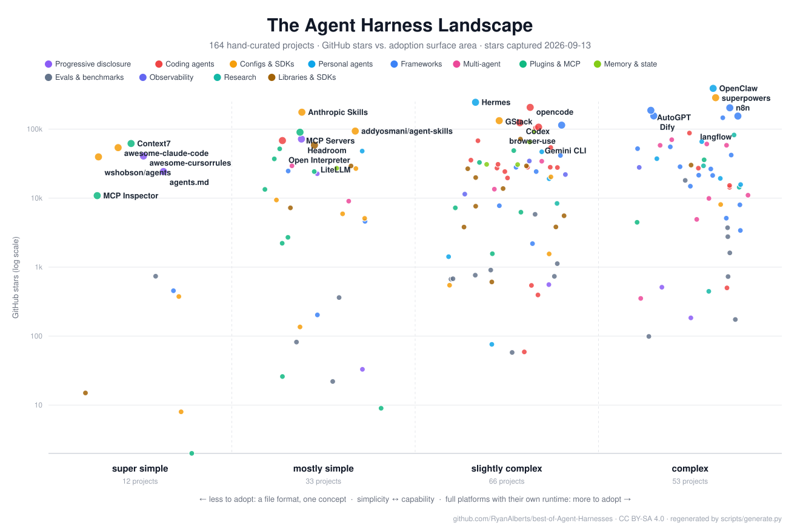
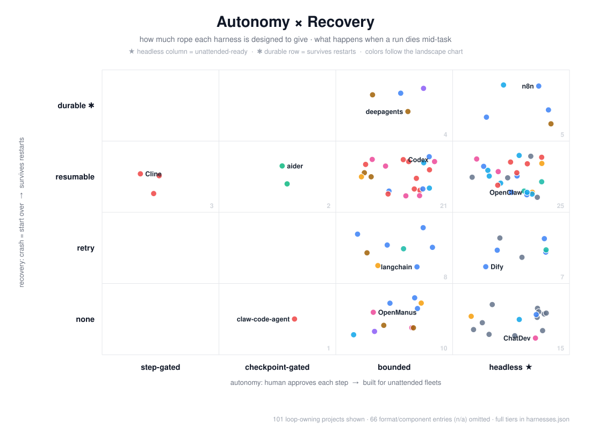

# The agent harness landscape, in two charts

Both charts plot every project in [best-of-Agent-Harnesses](README.md), a curated list of 161 agent harnesses: the runtimes that turn an AI model into a working agent. They regenerate from the list data on every weekly refresh, so what you see is current.

## Adoption surface vs. stars

Left to right is the simplicity-to-capability scale: how much you take on by adopting a project, from **super simple** (a file format, nothing to run) to **complex** (a platform with its own runtime and ecosystem). Height is GitHub stars. Colors are categories; the largest projects in each tier are labeled. The practical read: pick the *lowest* tier that solves your job, because every step right is something you will maintain, secure, and eventually migrate off.

## Autonomy vs. recovery

Across is autonomy: how unattended each harness is designed to run, from **step-gated** (asks before every action) to **headless** (built for nobody watching). Up is recovery: what survives a dead run, from **none** (start over) to **durable** (execution state persists across restarts). The top-right corner is the short list for anything long-running and unattended; a harness that is headless with no recovery story is an incident generator.

## Where to go next

Start with [How to pick a harness](comparisons/how-to-pick-a-harness.md), or jump into the head-to-head decision guides:

- [Agent evals: SWE-bench vs inspect_ai vs Terminal-Bench](comparisons/agent-eval-harnesses.md)
- [Browser agents: browser-use vs Stagehand vs Playwright MCP vs chrome-devtools-mcp](comparisons/browser-agents.md)
- [Browser infrastructure for agents: Browserbase vs Steel vs Hyperbrowser](comparisons/browser-infrastructure.md)
- [Claude Code skill packs: superpowers vs GStack vs get-shit-done vs Anthropic Skills](comparisons/claude-code-skill-packs.md)
- [Eval and observability platforms: Langfuse vs LangSmith vs Braintrust vs Phoenix](comparisons/eval-platforms.md)
- [How to pick a harness](comparisons/how-to-pick-a-harness.md)
- [Agent memory layers: Mem0 vs Zep vs Letta vs claude-mem](comparisons/memory-layers.md)
- [Multi-agent orchestration: OpenAI Agents SDK vs CrewAI vs AutoGen vs Agent Framework vs LangGraph](comparisons/multi-agent-orchestration.md)
- [OpenClaw vs Hermes: the always-on personal-agent debate](comparisons/openclaw-vs-hermes.md)
- [Context files for agents: AGENTS.md vs CLAUDE.md vs skills vs MCP tool search](comparisons/progressive-disclosure.md)
- [Agent sandboxing: what it is and how to pick](comparisons/sandboxed-code-execution.md)
- [Terminal coding agents: opencode vs Codex vs Gemini CLI vs crush vs goose](comparisons/terminal-coding-agents.md)

Agents can query the same data: the [MCP server](mcp/) (`claude mcp add agent-harnesses -- uvx agent-harnesses-mcp`), [llms.txt](llms.txt), and [harnesses.json](harnesses.json).
